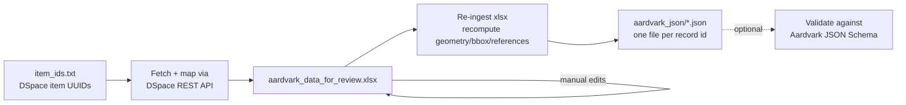

# DSPACE_to_sheet_to_Geoblacklight

Jupyter notebook that pulls dataset item metadata from a DSpace 7 repository
(via its REST API), maps it to the [OpenGeoMetadata Aardvark](https://opengeometadata.org/ogm-aardvark/)
schema, and produces one validated Aardvark JSON file per item for ingest into
GeoBlacklight (e.g. UMass ScholarWorks GIS/data holdings).

The workflow is split into three stages, with a manual review step in the
middle so a human can correct/enrich fields (titles, geometry, resource
class, etc.) before the final JSON is generated.

## Contents

| File | Purpose |
|---|---|
| `DSpace_to_sheet_to_Geoblacklight.ipynb` | Main notebook containing the full pipeline (see Notebook Structure below). |
| `dc_ard_map.txt` | Mapping rules of `dspace_field:aardvark_field` (one per line, `:` separated). Left-hand side blank means the field is hardcoded/derived instead of mapped from a source field. |
| `item_ids.txt` | Input list of DSpace item UUIDs to fetch, one per line. Blank lines and lines starting with `#` are ignored. |
| `aardvark_data_for_review.xlsx` | Output of the batch fetch/map step; the spreadsheet a reviewer hand-edits before JSON is generated. |
| `aardvark_json/` | Output directory; one `<id>.json` Aardvark record per row of the reviewed spreadsheet. |
| `requirements.txt` | Python dependencies (auto-generated by Posit Publisher). |

## Requirements

- Python 3.13 (a `.venv` is expected at the project root)
- `pandas`, `requests`, `jupyter` (see `requirements.txt`)
- `openpyxl` (required by pandas to read/write `.xlsx` files)
- Network access to the source DSpace repository's REST API

## Notebook structure

1. **Setup** — imports and the source repository base URL (`repository`, e.g.
   `https://scholarworks.umass.edu/`).
2. **Schema template** — hardcodes the Aardvark field names (`field_names`)
   used to build each empty record.
3. **Mapping rules** — loads `dc_ard_map.txt` into `mapping_rules`.
4. **Core functions**:
   - `get_original_bundle_downloads(item_json)` — follows an item's
     `bundles` → `ORIGINAL` bundle → `bitstreams` → `content` link chain to
     list downloadable files and sizes.
   - `map_metadata_to_ardvark(uuid, metadata, downloads)` — maps a raw
     DSpace metadata dict to an Aardvark record dict, applying
     `mapping_rules` plus hardcoded/derived defaults (`schema_provider_s`,
     `dct_publisher_sm`, `dct_accessRights_s`, etc.). Geometry, bbox, and
     `dct_references_s` are intentionally left blank here since they depend
     on fields a reviewer may hand-edit.
   - `build_ardvark_record(item_id)` — fetches one item from the API and
     runs it through the mapping function.
5. **Batch processing** — reads UUIDs from `item_ids.txt`, calls
   `build_ardvark_record` for each (with a 1-second delay between requests),
   and collects successes/failures.
6. **Export for review** — writes all mapped records to
   `aardvark_data_for_review.xlsx`.
7. **Manual-edit step** (markdown) — download, hand-edit, and save
   `aardvark_data_for_review.xlsx`. Multi-valued columns (suffix `_sm`/`_im`)
   must remain `; `-separated; do not add or remove columns.
8. **Re-ingest** — reloads the (possibly edited) spreadsheet and recomputes:
   - `locn_geometry` / `dcat_bbox` from `box_westlimit/eastlimit/northlimit/southlimit`
   - `dcat_centroid` from `point_north`/`point_east` (preferred) or the
     midpoint of the box fields (fallback)
   - `dct_references_s` from `url_dataset` and `url_download_<n>_link`/`_type`
9. **JSON generation** — `row_to_aardvark_json(record)` converts each row
   into a properly typed Aardvark JSON document: `_sm`/`_im` columns become
   lists (semicolon-split), `_b` columns become booleans, `box*`/`url*`
   columns and internal helper columns (`dspace_UUID`, `geospatial`, `dsl`,
   `change*`) are dropped, and `id` is lowercased. Files are written to
   `aardvark_json/<id>.json`, stamped with a fresh `gbl_mdModified_dt`.
10. **Validation (optional, commented out)** — validates every JSON file in
    `aardvark_json/` against the official OGM Aardvark JSON Schema using
    `jsonschema`. Uncomment and `pip install jsonschema` to use.

## Usage

1. Add DSpace item UUIDs (one per line) to `item_ids.txt`.
2. Run the notebook top to bottom through the "Export for review" cell.
3. Open `aardvark_data_for_review.xlsx`, correct/fill in values (title,
   geometry box fields, resource class, etc.), and save.
4. Run the re-ingest cell, then the JSON-generation cell.
5. Check `aardvark_json/` for the generated `<id>.json` files. Optionally run
   the validation cell to confirm schema compliance.

## Data-quality note

Multi-valued (`_sm`) and multi-integer (`_im`, e.g. `gbl_indexYear_im`)
columns must use `; ` as the separator when hand-edited in the review
spreadsheet. 
